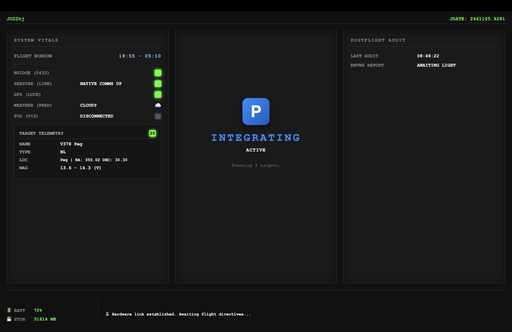

# 🔭 Seestar Federation Command (S30-PRO)

> **Objective:** Primary documentation and entry gate for the automated S30-PRO variable star observation pipeline.
> **Version:** 1.5.0 (Humpie / Storage & Telemetry Baseline)

Welcome to the **S30-PRO Federation**, an advanced, headless, and fully automated orchestration system for the Seestar smart telescope ecosystem. This project bypasses standard app limitations, providing a robust Python-based backend that handles everything from dynamic multi-source weather prediction to real-time hardware telemetry and target vetting.

## 🎯 Scientific Mission Profile & Hardware Constraints

The **S30-PRO Federation** is an autonomous photometric pipeline engineered specifically for the constraints of a 30mm f/5.3 aperture and an IMX585 colour sensor (GRBG Bayer matrix). Operating at a wide pixel scale of ~3.74 arcsec/pixel, this system avoids crowded fields and high-precision micro-variability, focusing instead on high-amplitude, scientifically valuable targets.

**Target Acquisition Strategy:**
* **Primary Focus:** Long-Period Variables (Miras, Semi-Regulars) and Symbiotic binaries. The wide FOV ensures comparison stars are consistently captured, while the large magnitude swings (2–8 mag) forgive the wide pixel scale.
* **Triggered Observations:** Cataclysmic Variables (CVs) in outburst (e.g., SS Cyg, U Gem).

**Photometric Output:**
Due to the lack of standard Johnson-Cousins filters, all photometric data is processed via V-equivalent extractions. Submissions to the AAVSO are strictly reported as **"TG"** (Green channel as V-proxy) or **"CV"** (Clear with V-zeropoint) to ensure absolute scientific integrity.

---

## ✨ The Crown Jewel: The Tactical Dashboard

At the heart of the Federation is a custom-built, high-availability web interface providing real-time situational awareness of the telescope and the night sky.

* **Live Hardware Vitals:** Bypasses standard APIs to dynamically poll the Seestar for sub-second battery and storage updates, complete with anti-flicker caching for Wi-Fi resilience.
* **Tri-Source Weather Sentinel:** Aggregates data from *Open-Meteo*, *7Timer!*, and local *Meteoblue* seeing caches to predict the safety of the flight window, outputting live status emoticons (☁️, ⛈️, ⭐) directly to the UI.
* **Dynamic Target Ticker:** Continuously cycles through the consolidated flight plan, displaying prioritized targets, live altitude, and JDATE standard time.
* **Orchestrator State Engine:** Tracks the mount's status in real-time (PARKED, SLEWING, TRACKING, EXPOSING) with visual LED indicators and live flight logs.

---

## 🏰 Architecture: The 5-Block State Machine
This project relies on a strict **5-Block Linear State Machine**. All logic follows a unidirectional flow to ensure hardware synchronicity and prevent desynchronization errors.

1. **Block 1: Hardware & OS Foundation** (Debian Bookworm 64-bit, `ssc-3.13.5` virtual environment).
2. **Block 2: Seestar ALP Bridge** (Deterministic hardware mapping, zero-guess endpoints).
3. **Block 3: Preflight Gatekeeper** (Environment, weather, storage, and GPS auditing).
4. **Block 4: Flight Acquisition** (The AAVSO target sequence loop).
5. **Block 5: Postflight Teardown** (Safe parking, FITS transfer, and log generation).

### The Preflight Funnel & Zero-Hardcode Concept
The system doesn't just blindly point at the sky. The `consolidator.py` engine processes hundreds of potential targets through a rigorous mathematical filter (Solar Veto, Horizon Limits, Cadence Priority). Furthermore, the entire pipeline is built for portability. Location data (GPS/Maidenhead) and hardware IPs are dynamically parsed from a central `config.toml` file, ensuring zero sensitive data is hardcoded into the scripts.

---

## 🚀 Getting Started

*Note: Automated deployment (`setup_wizard.py`) is currently in development (Targeting Roadmap v1.9).*

To initialize the environment manually:
* **`bootstrap.sh`**: The mandatory initial execution to build and verify the Python OS layer and dependencies.
* **`core/flight/orchestrator.py`**: The primary state-machine controller managing the active observatory loop.

For technical deep-dives into our networking, state-machine logic, and AAVSO handshake protocols, see the **[Logic Directory](./logic/)**.

---

## 🍷 Slotwoord van een Heer van Stand
"Het is een hele zorg, nietwaar? De sterrenhemel is onmetelijk en de techniek staat voor niets... wij handelen hier volgens de regelen van het fatsoen!"
