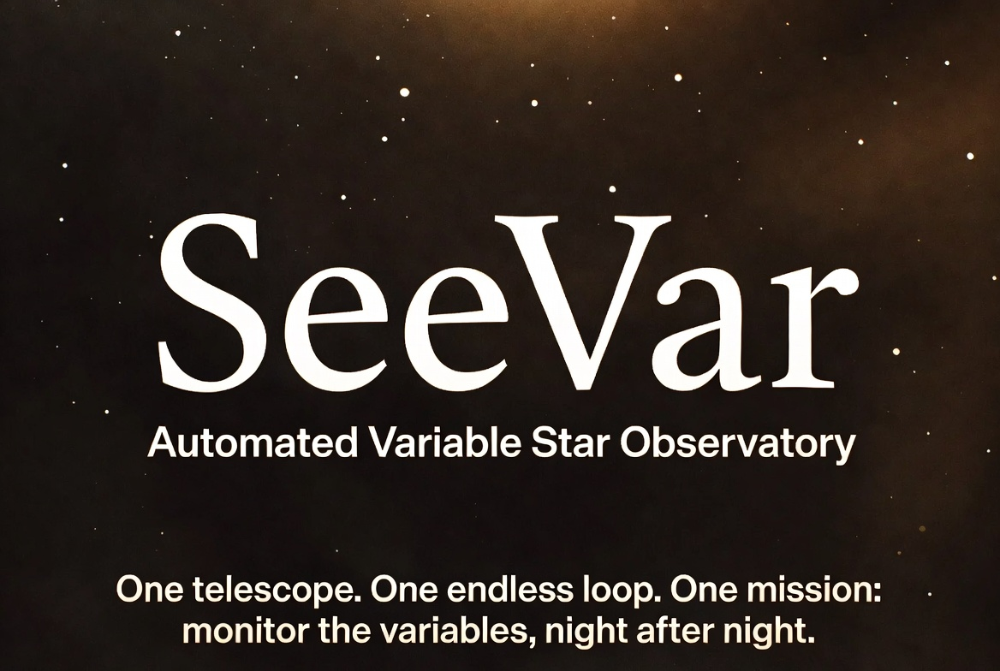
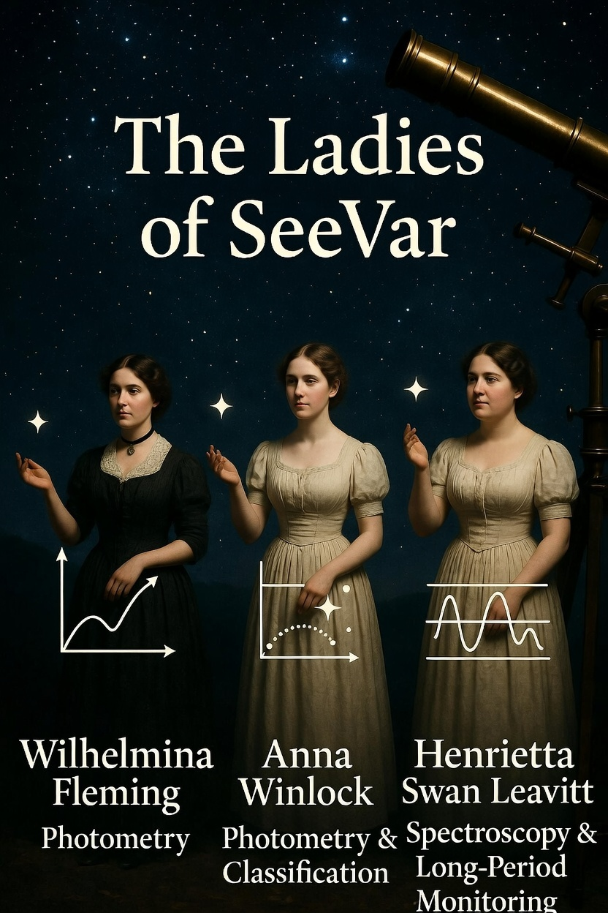
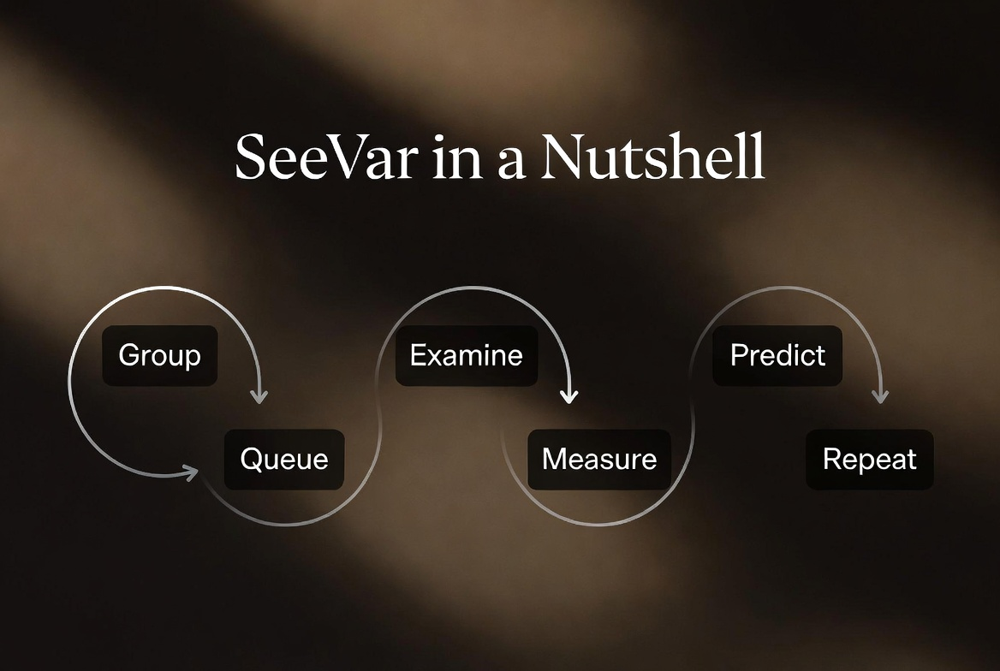
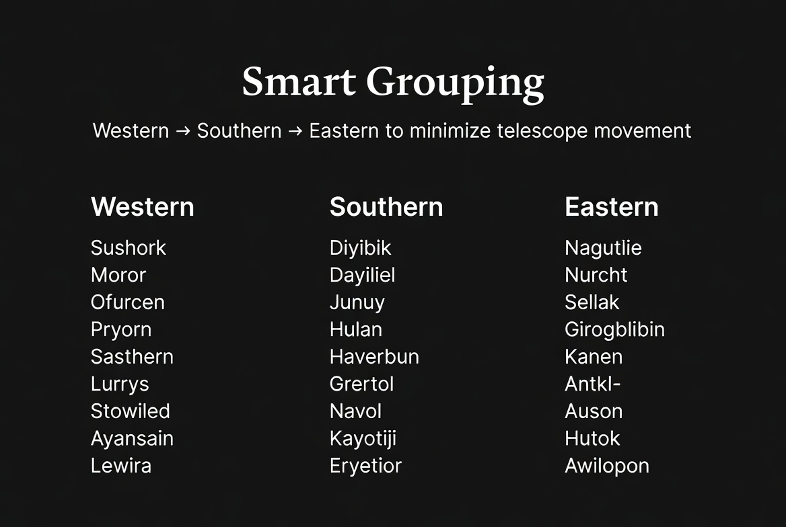
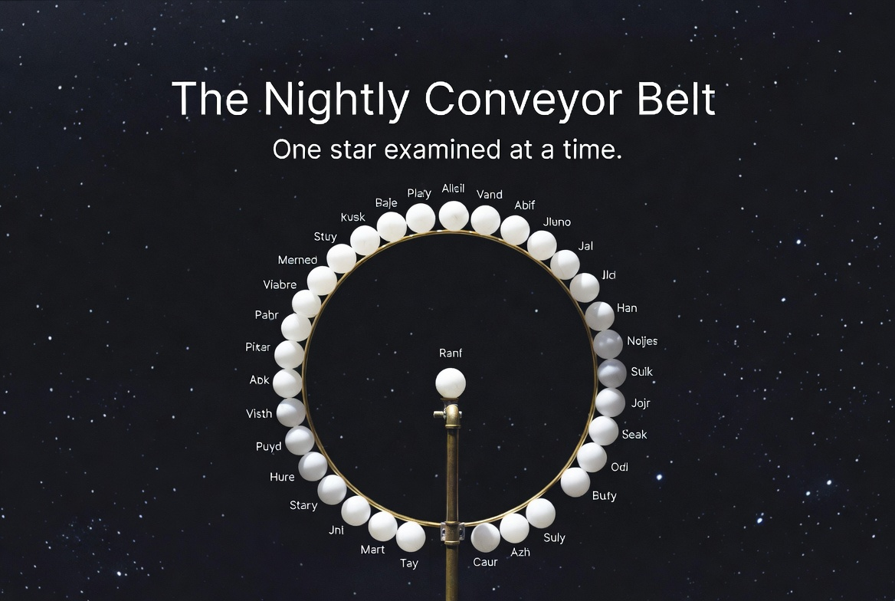
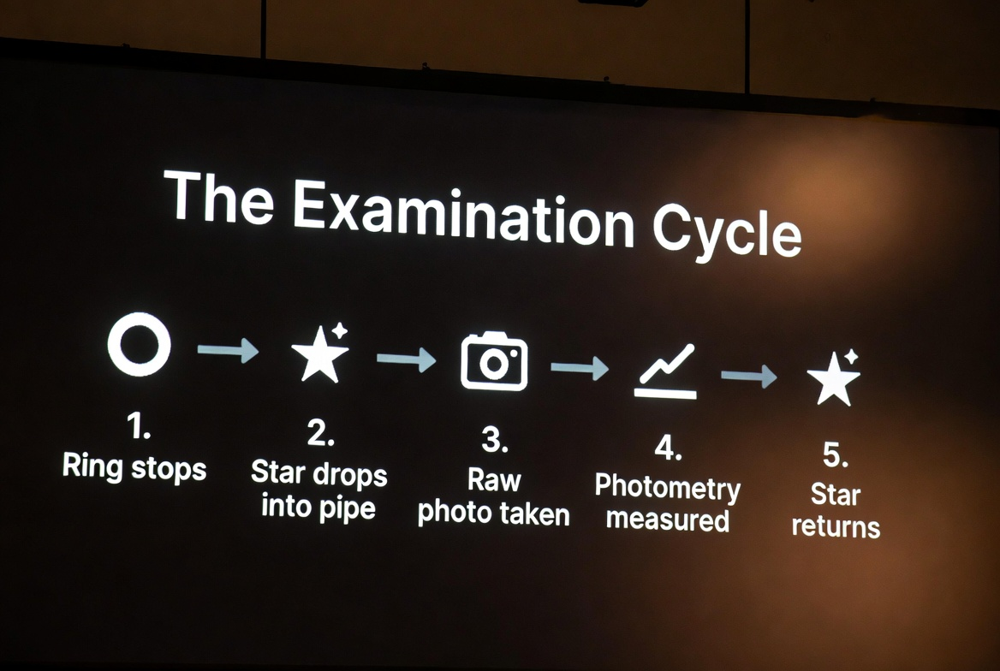
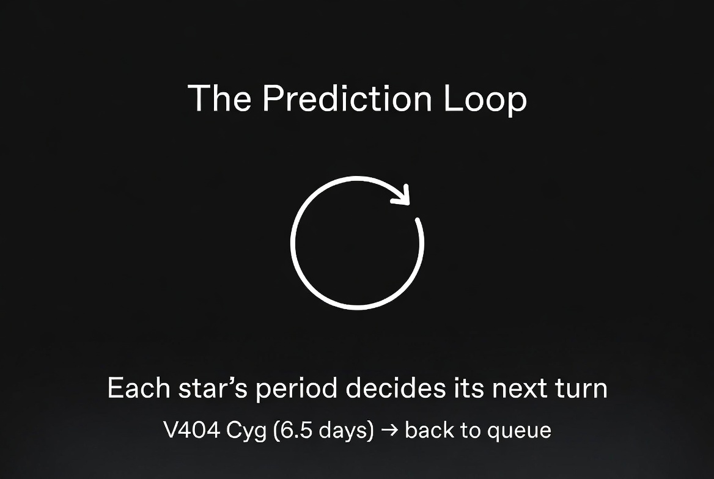
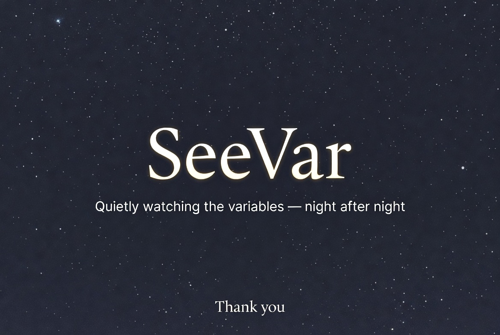

# SeeVar Presentation & Architecture Metaphors

This document pairs the SeeVar presentation slides with the architectural narrative. It serves both as a speaker's guide for astronomy club presentations and as a high-level conceptual overview for developers joining the SeeVar Federation.

*(Note: Ensure the slide images are placed in the same directory or adjust the image paths accordingly).*

---

## Slide 1: The Hook

**Narrative:**
* **The Pitch:** SeeVar isn't just about taking pretty pictures of the night sky; it is a relentless, autonomous science machine. 
* **The Context:** It took 6 weeks and 17 architectural revisions to achieve full "Sovereign" autonomy. One telescope. One endless loop. One mission.

---

## Slide 2: The Hardware & Inspiration

**Narrative:**
* **The Homage:** The telescope nodes and logic branches are named after the pioneers of variable star classification—the Harvard Computers (Wilhelmina Fleming, Anna Winlock, Henrietta Swan Leavitt).
* **The Setup:** "Wilhelmina" (the S30-Pro) handles the primary photometry duties for this specific pipeline.

---

## Slide 3: The High-Level Pipeline

**Narrative:**
* **The Workflow:** This is the logic engine at a glance. SeeVar gathers the AAVSO targets, groups them, queues them up, examines them, measures the photometry, predicts the next observation window, and repeats.

---

## Slide 4: Beating the Hardware Limits

**Narrative:**
* **The Problem:** Standard alt-azimuth mounts and basic slew commands are highly inefficient for rapid-fire targeting.
* **The Solution:** The Orchestrator groups the night's plan strictly by Western → Southern → Eastern sectors. This minimizes dome and mount travel time, maximizing actual photon-gathering time.

---

## Slide 5: The Core Metaphor

*(Visual variations: [0.jpg](0.jpg), [1.jpg](1.jpg))*

**Narrative:**
* **The Concept:** Think of `ledger_manager.py` and `tonights_plan.json` as a physical conveyor belt.
* **The Mechanics:** The targets are suspended in a queue, waiting for their precise turn to drop into the telescope's examination pipe. It is a strictly controlled, deterministic flow.

---

## Slide 6: The Execution

**Narrative:**
* **The Micro-Level:** What happens during the few minutes the telescope spends on a single target?
* **The Action:** The mount stops (Ring stops), the star drops into the pipe, the exposure planner acquires the raw FITS (Raw photo taken), the accountant measures the differential photometry, and the star returns to the ledger.

---

## Slide 7: The Scientific Cadence

**Narrative:**
* **The Intelligence:** This separates SeeVar from a simple GoTo script. It enforces the "1/20th rule".
* **The Logic:** The system reads the star's period (e.g., V404 Cygni's 6.5 days) to dynamically calculate exactly when it needs to be placed back on the conveyor belt to ensure science-grade sampling.

---

## Slide 8: The Wrap-Up

**Narrative:**
* **The Conclusion:** While the world sleeps, SeeVar is out there quietly and relentlessly building a pristine ledger of scientific data, night after night.
